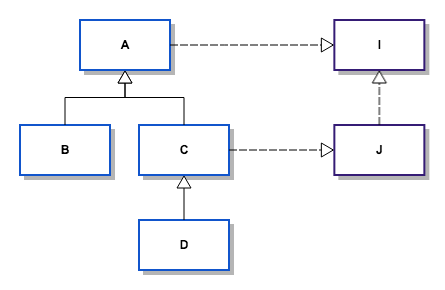

# Lancet

[Chinese README](README_zh.md)

Lancet is a lightweight AOP framework for Android.

It's fast and just take up a little time during compiling. Also, it supports incremental compiling.

But it provides great api to help you coding in Android.

It takes no runtime jar.

In addition, not only App developers but also SDK developers can use Lancet.

## Usage
### Installation

Firstly, add following code in root **build.gradle** of your project.

```groovy
dependencies{
    classpath 'me.ele:lancet-plugin:1.0.4'
}
```
And then, add following code in your **application module's build.gradle**

```groovy
apply plugin: 'me.ele.lancet'

dependencies {
    provided 'me.ele:lancet-base:1.0.4'
}
```

That's OK.Now you can follow our tutorial to learn how to use it.

### Tutorial

Lancet use annotation to indicate where to cut the code and focus on interacting with origin class's methods and fields;

Firstly, let's see a example.
Look at the following code:

```java
@Proxy("i")
@TargetClass("android.util.Log")
public static int anyName(String tag, String msg){
    msg = msg + "lancet";
    return (int) Origin.call();
}
```

There are some key points: 

* ```@TargetClass``` directly locate the target ```android.util.Log```
* ```@Proxy```locate the method name```i```
* ```Origin.call()``` will be replaced by```Log.i()``` as we explained above
* so the influence is every ```Log.i```'s second parameter```msg``` will has a trailing **"lancet"**


### Choose target class

```java
public @interface TargetClass {
    String value();

    Scope scope() default Scope.SELF;
}

public @interface ImplementedInterface {

    String[] value();

    Scope scope() default Scope.SELF;
}

public enum Scope {

    SELF,
    DIRECT,
    ALL,
    LEAF
}
```
We use the three classes above to locate our targets.

#### @TargetClass

 1. **value** in ```@TargetClass``` should be a full class name.
 2. Scope.SELF means the target is the class named by **value**
 3. Scope.DIRECT locate the direct subclasses of **value**
 4. Scope.All indicates the all subclasses of **value**
 5. The Scope.LEAF is a little bit special, it means all leaf subclasses of **value**.For example: ```A <- B <- C, B <- D```, the leaf children of A are C and D.

#### @ImplementedInterface

1. **value** in ```@ImplementedInterface``` is a string array filled with full interface names and classes that satisfied all conditions will be chosen.
2. Scope.SELF : all classes implements interfaces **literally**
3. Scope.DIRECT : all classes implements interfaces or their children interfaces **literally**
4. Scope.ALL: all classes included in *Scope.DIRECT* and their childrens
5. Scope.LEAF: all classes in *Scope.ALL* with no children.

Let's see a illustration.



When we use```@ImplementedInterface(value = "I", scope = ...)```, the targets are:

* Scope.SELF -> A
* Scope.DIRECT -> A C
* Scope.ALL -> A B C D
* Scope.LEAF -> B D


### Choose target method

#### Choose method name

```java
public @interface Insert {
    String value();
    boolean mayCreateSuper() default false;
}

public @interface Proxy {
    String value();
}

public @interface TryCatchHandler {
}

public @interface NameRegex {
    String value();
}

```

##### @TryCatchHandler

This annotation is easy.

```java
@TryCatchHandler
@NameRegex("(?!me/ele/).*")
    public static Throwable catches(Throwable t){
        return t;
    }
```

As the code above, it hook every try catch handle, you can deal with and return. And the control flow will jump to it's origin space.

But with the ```@NameRegex```, something is different.

##### @NameRegex

@NameRegex is used to restrict hook method by match the class name.Be caution, the *dot* in class name will be replaced by *slash*.

String value in @NameRegex will be compiled to pattern. the hook method only works if the pattern matches the class name where appear the cut point.

Such as the above example, every class will be ignored if it's package name start with "me.ele.";

@NameRegex can only be used with @Proxy or @TryCatchHandler.

##### @Proxy and @Insert

1. **Value** in ```@Proxy``` and ```@Insert``` is the target method name.
2. ```@Proxy``` means to hook every invoke point of the target method.

3. ```@Insert``` means to hook the code inside the method.
4. In another word, if you use @Insert to hook a method, the running code in the target method will be changed.But ```@Proxy``` can control the scope by using it combined with ```@NameRegex```.
5. Another different is, classes in Android's ROM can't be touched as compiling time.So we can't use @Insert if we want to change the behavior of ROM's classes, but @Proxy can do it.

@Insert has a special boolean parameter is ```mayCreateSuper```.Let's see a example.

```java

@TargetClass(value = "android.support.v7.app.AppCompatActivity", scope = Scope.LEAF)
@Insert(value = "onStop", mayCreateSuper = true)
protected void onStop(){
    System.out.println("hello world");
    Origin.callVoid();
}
```

The goal method of the hook method is 
every leaf child of AppcompatActivity ```void onStop()```.

If a class ```MyActivity extends AppcompatActivity```do not override the onStop method, we will create a method for ```MyActivity``` like this:

```java
protected void onStop() {
    super.onStop();
}
```

And then hook the method.

If you open the flag, it will always create the method if target class has no matched method no matter it has the super method or doesn't.

And the public/protected/private flag is inherited from above hook method.This is the flag's only use.

Also be care that 

#### Choose method descriptor

The example shown at first also indicates a important rule which is the strict match.The ```Log.i``` 's full descriptor is **"int Log.i(String, String)"**, more precisely "**"(Ljava/lang/String;Ljava/lang/String;)I"**". 

It means our hook method should have the same method descriptor and static flag with target method.

It doesn't matter if you don't known method descriptor. You can have a look at [JVM Specification Chapter 4.3](https://docs.oracle.com/javase/specs/jvms/se7/html/jvms-4.html#jvms-4.3) if interested.

We doesn't care if parameters' generic type are the same or not.In another word, we don't care signature of method, only descriptor.

Also, exceptions declaration is also ignorable.You can write them for convenience.

Any other access flag will be ignored except private/protected/public/static that we said above.

##### @ClassOf

Sometimes, we can't directly declare a class that we can't touch as parameter of our hook method.

we can use ```@ClassOf``` to do this job.

Take a look at the following example:

```java
public class A {
    protected int execute(B b){
        return b.call();
    }

    private class B {

        int call() {
            return 0;
        }
    }
}

@TargetClass("com.dieyidezui.demo.A")
@Insert("execute")
public int hookExecute(@ClassOf("com.dieyidezui.demo.A$B") Object o) {
    System.out.println(o);
    return (int) Origin.call();
}
```

We use ```@ClassOf```to locate the parameter's actual type.

And the parameter declared in method should be it's super class, such as ```java.lang.Object```;

value in @ClassOf should be in the form of **"(package_name.)(outer_class_name$)class_name([]...)"**, such as:
* java.lang.Object
* java.lang.Integer[][]
* A[]
* A$B

if no ```@ClassOf```, the hook method's descriptor is **"(Ljava/lang/Object;)I"**. But now it is **"(Lcom/dieyidezui/demo/A$B;)I"**.

So the ```hookExecute``` method can match ```A.execute```.

### API

Till now, we have two classes to use, they are ```Origin``` and ```This```.

#### Origin

```Origin``` is used to call original method.
You can invoke its method zero or one more times if you like.

##### Origin.call/callThrowOne/callThrowTwo/callThrowThree()
This group API is used for call the original method which has return value.
You should cast it to original type that the same with hook method descriptor's return type.

##### Origin.callVoid/callVoidThrowOne/callVoidThrowTwo/callVoidThrowThree()

Similar with above three methods, these methods are used for method without return value.

By the way, the ```ThrowOne/ThrowTwo/ThrowThree``` are for deceiving the compiler if you want to catch some exceptions for some convenience.

For example:

```java
@TargetClass("java.io.InputStream")
@Proxy("read")
public int read(byte[] bytes) throws IOException {
    try {
        return (int) Origin.<IOException>callThrowOne();
    } catch (IOException e) {
        e.printStackTrace();
        throw e;
    }
}
```

So that on every invoke point of ```int InputStream.read(byte[])```, if ```IOException``` happens, we will see its stacktrace. 

#### This

##### get()

This method is used for none static method to find this object.
You can cast it to its actual type.

###### putField(Object, String) / getField(String)

You can directly get or put a field in the target class even if the field is protected or private!

What's more! If the field name is not exists, we will create it for you!

Auto box and unbox are also supported.

Also, we have some restricts:

* These two methods only are only allowed to use with ```@Insert``` till now.
* You can't retrieve it's field of super class. When you try to get or put a field that it's super class has. We still will create the field for you. If the field of super class is private, it's OK. Otherwise, you will get a error at runtime.

For example:

```java
package me.ele;
public class Main {
    private int a = 1;

    public void nothing(){

    }

    public int getA(){
        return a;
    }
}

@TargetClass("me.ele.Main")
@Insert("nothing")
public void testThis() {
    Log.e("debug", This.get().getClass().getName());
    This.putField(3, "a");
    Origin.callVoid();
}

```

Then we run the following codes:

```java
Main main = new Main();
main.nothing();
Log.e("debug", "a = " + main.getA());
```

We will see:

```
E/debug: me.ele.Main
E/debug: a = 3
```

## Tips
1. Inner classes should be named like  ```package.outer_class$inner_class```
2. SDK developer needn't to apply plugin, just ```provided me.ele:lancet-base:x.y.z```
3. Although we support incremental compilation. But when you use ```Scope.LEAF、Scope.ALL``` or edit the hook class, the incremental judgement will be a little special. It may cause full compilation.

## License

Licensed under the Apache License, Version 2.0 (the "License");
you may not use this file except in compliance with the License.
You may obtain a copy of the License at

   http://www.apache.org/licenses/LICENSE-2.0

Unless required by applicable law or agreed to in writing, software
distributed under the License is distributed on an "AS IS" BASIS,
WITHOUT WARRANTIES OR CONDITIONS OF ANY KIND, either express or implied.
See the License for the specific language governing permissions and
limitations under the License.


